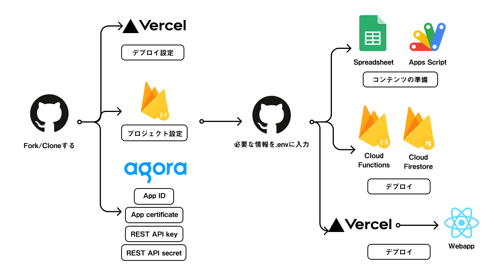

# 《i.frame》

日本語 | [English](README_en.md)

## 《i.frame》とは

《i.frame》は、2021年7月22・23日に開催された[情報科学芸術大学院大学［IAMAS］](https://www.iamas.ac.jp/)のオンラインイベント「[iamas open_house: 2021](https://www.iamas.ac.jp/report/iamas-oh2021/)」のために開発した、情報空間におけるイベントのプラットフォームです。「i.frame」という名前は、ウェブ技術における基本的なHTML要素のひとつで、ページの中に他のページを埋め込むために用いられる「[iframe](https://developer.mozilla.org/ja/docs/Web/HTML/Element/iframe)」（インラインフレーム）に由来しています。この技術を用いることにより、インターネット上で展開している様々な展示やセッションを一箇所に集めることなく、イベント期間中に限定して繋がりと纏まりを提供することができます。また、音声とテキストの2つのメディアを使ったチャットを提供することで、別々の場所から訪れた人々が、あたかも同じ場に集まっているかのように感じることもできるでしょう。

[](https://www.youtube.com/watch?v=ZVNaVIxs640)

## 《i.frame》の特徴

《i.frame》でできる重要なこと：

* インターネット上に分散するWebサイト群に対して一時的に繋がりと纏まりを提供してイベントを構成する
* 音声とテキストにより参加者同士が会話できるチャットを提供する
* 展示とセッションという異なる形態のプログラムを組み合わせる
* 匿名ユーザーと登録ユーザーの両方に参加方法を提供する
* WebサイトのURLとイベント個別URLの両方を参加ルートとして提供する
* 運営担当者から参加者全体に対してメッセージを通知する
* デスクトップとスマートフォンの両方をサポートする
* UIや各種情報を日本語と英語の両方で提供する
* データベースのフロントエンドとしてのGoogle スプレッドシートで手軽に更新する

## 用語説明

### 主な用語

* イベント（event）：プログラム群から構成される全体（例：iamas open_house: 2021）を指す
* プログラム（program）：イベントを構成する単位
  * 展示（installation）：イベントの開催期間中いつでもアクセスできるプログラム
  * セッション（session）：特定の時間帯のみアクセスできるプログラム
* チャット（chat）：音声またはテキストでコミュニケーションできる機能で、単位はチャンネル（channel）
  * 参加時の初期状態はミュートに設定されており、参加者が自分でミュートを解除することで発話できる
  * 音声による発話をしたくない／できない参加者は、テキストチャットでも参加できる
* 通知：Webサイトの上部に表示される運営からのメッセージ
* タグ：プログラム間に繫がりを提供する付ける文字列（タグ自体の解説文も記述できる）

### 展示とセッションの違い

|                        | 展示         | セッション                             |
|------------------------|--------------|----------------------------------------|
| 開催時間帯の情報       | なし         | あり（必須：日付、開始時刻、終了時刻） |
| セッション一覧への掲載 | なし         | あり                                   |
| iframe                 | あり         | ←                                      |
| 詳細情報               | あり（任意） | ←                                      |
| 独自URL                | あり         | ←                                      |
| 紐付いたチャット     | なし         | あり（任意）                           |
| タグ                   | あり（任意） | ←                                      |

### 匿名ユーザーと登録ユーザーの違い

|                                      | 匿名ユーザー           | 登録ユーザー         |
|--------------------------------------|------------------------|----------------------|
| ログイン                             | 不要                   | 必要                 |
| 開催中のチャット作成                 | ○                      | ←                    |
| セッションに紐付いたチャットの作成 | ×                      | ○                    |
| アバター                             | 用意されたものから選択 | 任意の画像を指定可能 |
| 名前                                 | 選択したアバターに連動 | 任意の名前を指定可能 |

## セットアップ



### 動作確認済みのローカル環境

* Node v14.17.5
* npm 6.14.14
* yarn v1.22.17

### GitHubの設定

1. このリポジトリをフォークする。
2. ローカルコンピューターにリポジトリのクローンを作成する。

### Vercelの設定

1. [https://vercel.com/](https://vercel.com/) にGithubアカウントでログインまたはサインアップする（サインアップの際はVercelからのアクセスを要求されるので許可する）。
2. 右上の［New Project］ボタンをクリックする。
3. ［Import Git Repository］から、先程フォークしたリポジトリを選択してインポートする。
   * 目的のGitHubアカウントが表示されない場合は、ネームスペースのリストからVercelをインストールするGitHubアカウントを追加する。
   * GitHubアカウントは表示されるのに目的のリポジトリが表示されない場合は、［Adjust GitHub App Permissions］をクリックしてVercelに許可を与える）。
4. ［Build and Output Settings］の中の［BUILD COMMAND］の［OVERRIDE］を有効にし、［`CI='' npm run build`］を入れる。
5. ［Deploy］ボタンを押してデプロイを開始し、デプロイが終わるまで数分間待つ。
6. デプロイが終わったら画面が切り替わるため、［Go to Dashboard］ボタンをクリックしてダッシュボードに戻る。
   * 注記：これ以降、GitHubのmainブランチが更新されるたびに自動でデプロイされる。
7. 最初のデプロイ時には、ドメインはプロジェクト名を基に自動的に設定される（例：［PROJECT NAME］が`iamas-open-house-2021`であれば`iamas-open-house-2021.vercel.app`など）。もし変更したければ、［View Domains］ボタンをクリックして設定する。最終的に確定した公開Webサイトのオリジン（例：`https://iamas-open-house-2021.vercel.app`）を控えておく（オリジンなので最後にスラッシュは含まないことに注意）。 :memo:

### Agoraの設定

1. [https://www.agora.io/](https://www.agora.io/) にアクセスし、アカウントを登録する。
2. アカウント登録後、最初に作成したプロジェクトは動作確認およびデモ用のものになる。プロジェクトが作成されたら、クレジットカードの登録など必要な設定を済ませておく。
3. あらためて、画面左の［Project Management］をクリックし、［Create］ボタンをクリックして新規にプロジェクトを作成する。その際［Authentication Mechanism］は［Secured mode］を指定する。
4. ［Project Management］画面で作成したプロジェクトの［Action］をクリックして、［App Configuration］にある［App ID］と、［App certificate］の［Primary certificate］をコピーして控えておく。 :memo:
5. 画面右上のアカウント名にマウスオーバーし、表示されるリストから［RESTful API］を選択する。表示された画面で［Add a secret］をクリックして、［Customer Secret］欄に表示される［Download］ボタンをクリックしてkeyとsecret情報をダウンロードしておく。 :floppy_disk:

### Firebaseの設定

#### Firebase コンソールでの作業（その1）

1. [https://firebase.google.com/](https://firebase.google.com/) にアクセスしてGoogleアカウントでログインする
2. 画面右上の［コンソールへ移動］をクリック
3. ［プロジェクトを追加］をクリックし、プロジェクト名を入力して作成する（Google Analyticsは必要に応じて設定する）。
4. 画面左のリストから［構築］→［Functions］を選択し、「プロジェクトをアップグレード」をクリックする。［選択したプラン］が［Blaze］になっていることを確認し、［購入］ボタンをクリックしてプランを購入する（必要に応じて［予算アラート］を設定してください）。
5. ［プロジェクトの概要］の右にある歯車をクリックして表示されるリストから［プロジェクトの設定］を選択し、表示された画面で表示される［プロジェクト ID］を控えておく。 :memo:
6. 画面左のリストから［構築］→［Firestore Database］をクリック、表示された画面で［データベースの作成］ボタンをクリック、［テストモードで開始する］を選択して［次へ］ボタンをクリック。［Cloud Firestore のロケーション］で、[アプリケーションが使用される場所に近いロケーション](https://firebase.google.com/docs/firestore/locations?hl=ja#location-r)を選択し、［有効にする］ボタンをクリックして有効にする。

#### ローカルコンピューターでの作業

1. クローンしたリポジトリの`firebase/.env.sample`をコピーして`firebase/.env`を作成し、 Agoraの認証情報と公開するウェブサイトのオリジンを入力する。

   | 変数名                   | 取得方法                                              |
   |--------------------------|-------------------------------------------------------|
   | `AGORA_APP_ID`           | Agoraで入手した`App ID`                               |
   | `AGORA_APP_CERT`         | Agoraで入手した`Primary certificate`                  |
   | `AGORA_REST_USER_NAME`   | AgoraからDLした`key_and_secret.txt`ファイルの`key`    |
   | `AGORA_REST_USER_SECRET` | AgoraからDLした`key_and_secret.txt`ファイルの`secret` |
   | `SITE_ORIGIN`            | 公開するウェブサイトのオリジン                        |

2. `firebase/.firebaserc`の`projects.default`をFirebaseのプロジェクトIDに変更する。
3. クローンしたリポジトリのディレクトリで次のコマンドを実行し、Firebaseをセットアップする。

   ```:shell
   yarn setup:firebase
   ```

4. 続けて次のコマンドを実行し、ソースコードをFirebaseに反映する。

   ```:shell
   yarn deploy:firebase
   ```

### Google Apps Scriptの設定

#### Google クラウド コンソールでの作業

スプレッドシートからFirestoreを更新するため、「Google Workspace 管理者 ヘルプ」の記事「[サービス アカウントの作成](https://support.google.com/a/answer/7378726?hl=j)」を参照してサービスアカウントを作成する。

1. ステップ 1: プロジェクトを作成する
   1. 説明に従って2番目まで進める。
   2. 3番目に進まず、代わりに［リソースの管理］画面でFirebaseで作成したプロジェクトを選択しておく。
2. ステップ 2: サービス アカウントに対して API を有効にする
   1. 説明に従って2番目まで進める（画面上部に表示されるプロジェクトが「ステップ 1」で選択したものでない場合には、リスト表示から選択する。
   2. 3番目では「Admin SDK API」と「Google Cloud Firestore API」の2つを有効にする。
3. ステップ 3: OAuth 同意画面を設定する
   1. 説明に従って最後まで進める。
4. ステップ 4: サービス アカウントを作成する
   1. 説明に従って2番目まで進める。
   2. 3番目の［サービス アカウント名］は任意の名前で構わない。続けて表示される［このサービス アカウントにプロジェクトへのアクセスを許可する］では、ロールとして［基本］（またはProject）→［編集者］と［Cloud Firestore］→［Cloud Firestore 編集者］の2つを追加する。
   3. 7番目に関して、［サービス アカウント］画面に表示される一覧の中でメールアドレスが「`*@*.iam.gserviceaccount.com`」のものをクリックし、画面上部に表示される［キー］をクリックする。

#### Google スプレッドシートでの作業

1. Google スプレッドシートの[テンプレート](https://docs.google.com/spreadsheets/d/1qCHVx4Po6ktpOybwsNlJuV3CKQvg34-Znc5QJBADrmk/edit?usp=sharing)からコピーを作成する。
2. ［拡張機能］→［Apps Script］を開き、`api.gs`の末尾で定義されている`_getCertData()`にある`{client_email}`、`{private_key}`、`{project_id}`を、それぞれダウロードした秘密鍵JSONファイルからコピーして書き換える。
3. ［Execution log］ボタンをクリックして実行ログを有効にし、［`installation.gs`］［`session.gs`］［`registered.gs`］［`tag.gs`］［`notification.gs`］を順に実行する。問題なく実行されれば、ログの最後に「`Execution completed`」が表示されるので、最後まで進んだことを確認する。
   * 注記：これらのスクリプトは、スプレッドシートの各シート［展示］［セッション］［ユーザー］［タグ］［【運営】全体通知］の右上にある［このシートを反映］ボタンをクリックすることでも実行できる。
4. Firebase コンソールで［構築］→［Firestore Database］→［データ］で、データベースに内容が登録されていることを確認する。

### デプロイ

#### Firebase コンソールでの作業（その2）

1. ［プロジェクトの概要］→［プロジェクトの設定］→［マイアプリ］で［</>］ボタンをクリックして、アプリのニックネームを入力し、［SDK の設定と構成］に表示されるコードから、`firebaseConfig`の内容を控えておく。 :memo:
2. ［構築］→［Functions］→［ダッシュボード］→［トリガー］欄に記載のあるURLを控えておく。 :memo:

#### Vercelでの作業

1. ［Project Settings］から［Environment Variables］タブを開いて、必要な環境変数を追加する。
   | 変数名（NAME）                           | VALUEの取得方法                               |
   |------------------------------------------|-----------------------------------------------|
   | `REACT_APP_FIREBASE_API_KEY`             | `firebaseConfig`の`apiKey`                    |
   | `REACT_APP_FIREBASE_AUTH_DOMAIN`         | `firebaseConfig`の`authDomain`                |
   | `REACT_APP_FIREBASE_PROJECT_ID`          | `firebaseConfig`の`projectId`                 |
   | `REACT_APP_FIREBASE_STORAGE_BUCKET`      | `firebaseConfig`の`storageBucket`             |
   | `REACT_APP_FIREBASE_MESSAGING_SENDER_ID` | `firebaseConfig`の`messagingSenderId`         |
   | `REACT_APP_FIREBASE_APP_ID`              | `firebaseConfig`の`appId`                     |
   | `REACT_APP_FIREBASE_FUNCTIONS_HOST`      | ［トリガー］欄に記載されたURL                 |
   | `REACT_APP_AGORA_APP_ID`                 | Agoraで入手した`App ID`                       |
   | `REACT_APP_GA_TRACKING_ID`               | Google アナリティクスのトラッキングID（任意） |

2. ［Deployments］タブでデプロイの一覧を表示し、先程行ったデプロイの右側にある［⁝］ボタンをクリックし、表示されるメニューから［Redeploy］を選択して再度デプロイする。

## カスタマイズ

### ソースコードの変更によるカスタマイズ

* イベント名を変更したい
  * `src/components/Head.js`の`<title>`タグ内を書き換える。
  * `src/configs/i18n.js`のキー`welcome_notes`に対応する値を書き換える（`ja`および`en`）。
  * `src/components/Splash.js`の`<StepContainer isShow={step === 0}>`ブロック内を書き換える。
  * `src/components/Typography.js`の`<Heading2>`タグ内を書き換える。
* 来場時に表示される画面の説明文を変更したい
  * `src/configs/i18n.js`の該当箇所を書き換える（`ja`および`en`）。
* 画面左上の［本イベントについて］をクリック／タップして表示されるページの内容を変更したい
  * `src/pages/About.js`を書き換える（`ja`および`en`）。
* ［セッション一覧］をクリック／タップして表示される［セッションスケジュール］の対象とする日付を変更したい
  * `src/pages/Timetable.js`の`<Wrapper>`タグ内を書き換える。
  * 同ファイルの`useState()`内で指定されている、初期状態で選択する日付を書き換える。

### スプレッドシートの変更によるカスタマイズ

* 登録ユーザー
  * ID :key:
  * ユーザー名：登録ユーザーの表示名（日本語表記とアルファベット表記）
  * サムネイル：サムネイル画像のURL
  * パスワード
* タグ
  * ID :key:
  * タグ名：タグの名前（日本語と英語）
  * 説明：タグの説明文（日本語と英語）
* 展示
  * ID
  * タイトル：展示のタイトル（日本語と英語）
  * 代表ユーザー：該当する登録ユーザーのID
  * 詳細：展示の説明文（日本語と英語）
  * Path：専用Webページのパス（`{オリジン}/installation/{パス}`） :key:
  * iframe：iframeで表示するWebページのURL
  * サムネイル：サムネイル画像のURL
  * タグ1〜3：該当するタグのID
  * 公開状態：ホーム画面の［いま見られる展示］に表示するか否か（値：`TRUE`＝公開・`FALSE`＝非公開）
* セッション
  * ID
  * タイトル：セッションのタイトル（日本語と英語）
  * 代表ユーザー：該当する登録ユーザーのID
  * 詳細：セッションの説明文（日本語と英語）
  * Path：専用Webページのパス（`{オリジン}/session/{パス}`） :key:
  * iframe：iframeで表示するWebページのURL
  * サムネイル：サムネイル画像のURL
  * タグ1〜3：該当するタグのID
  * 開催日：セッション一覧の［セッションスケジュール］に表示する日付（形式：`yyyy/mm/dd`）
  * 開始時刻：セッションの開始時刻（形式：`yyyy/mm/dd HH:MM:SS`）
  * 終了時刻：セッションの終了時刻（形式：`yyyy/mm/dd HH:MM:SS`）
  * 公開状態：ホーム画面の［開催中のセッション］および［セッション一覧］ボタンで表示される［セッションスケジュール］ページに表示するか否か（値：`TRUE`＝公開・`FALSE`＝非公開）
  * チャット表示状態：セッションに紐付いたチャットを表示するか否か（値：`TRUE`＝表示・`FALSE`＝非表示）
  * チャンネルID：セッションに紐付けるチャットのチャンネルID
* 通知
  * ID :key:
  * タイトル（日本語と英語）
  * 代表ユーザー：該当する登録ユーザーのID
  * 詳細（日本語と英語）
  * 表示期限：通知の表示期限（形式：`yyyy/mm/dd HH:MM:SS`）
  * 公開状態：通知を表示するか否か（値：`TRUE`＝表示・`FALSE`＝非表示）

#### スプレッドシートに関する注記

* それぞれのシートで :key: がついた欄は、データベース上のkeyであるため、ユニークな文字列になっている必要がある。
* ［このシートを反映］ボタンにより、指定したkeyに対応する値の追加および更新はできるが、削除はできない。このため、一旦作成したkeyを削除したい場合は、Firebase コンソール上で削除する必要がある。

## 運用

### 登録ユーザーとしてのログイン方法

1. スプレッドシートを確認して自分のIDとパスワードを控えておく。
2. 登録ユーザー入場用のリンク（ `{Webサイトのオリジン}/login` ）にアクセスする。
3. IDとPASS（パスワード）を入力してログインする。
4. 「〜としてログインしています」の「〜」に表示されている名前が正しいことを確認し、［Goto Home］ボタンをクリック／タップして入場する。
5. ログアウトするには、同じURLにアクセスして［Logout］ボタンをクリック／タップする。

### セッションに紐付いたチャットの作成

1. Webサイトに登録ユーザーとしてログインする。
2. ［セッション一覧］ボタンでセッションの一覧を表示し、チャットを紐付けたいセッションを選ぶ。
3. 画面左下のボタンをクリックし、表示されるダイアログの内容を確認して［OK］ボタンを押し、チャンネルを作成する。
4. ダイアログに表示されるチャンネルID（32桁の英数字）を控えておく。 :memo:
5. スプレッドシートを開き、チャットを紐付けたいセッションの［チャンネルID］欄に控えておいたチャンネルIDを記入する。

なお、セッションに紐付いたチャットがあると、セッションを訪れた参加者は自動的にそのチャットに参加することになります。

## ライセンス

MIT License

## クレジット

《i.frame》開発チーム

* [加藤明洋](https://github.com/croe)（フロントエンド）
* [永松歩](https://github.com/nama-gatsuo)（デザイン）
* [日比野光紘](https://github.com/nasustim)（バックエンド）
* [小林茂](https://github.com/kotobuki)（ディレクション）
