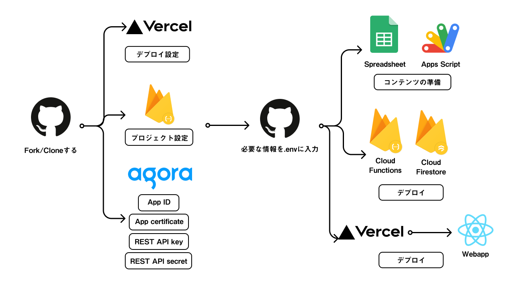

# *i.frame*

[日本語](README.md) | English

## What is *i.frame*?

*i.frame* is a platform for events in the information space developed for "[iamas open_house: 2021](https://www.iamas.ac.jp/report/iamas-oh2021/)", an online event held by the [Institute of Advanced Media Arts and Sciences [IAMAS]](https://www.iamas.ac.jp/en/). We derived the name *i.frame* from "[iframe](https://developer.mozilla.org/en-US/docs/Web/HTML/Element)" (inline frame), which is one of the basic HTML elements in web technology and is used to embed another page on a page. Using this technology, instead of gathering all the various installations and sessions distributed on the Internet in one place, you can provide cohesion and coherence for a limited period during an event. In addition, by providing chat using two media, voice and text, we aimed to make people from different places feel as if all participants gathered in the same place.

[](https://www.youtube.com/watch?v=ZVNaVIxs640)

## Features of *i.frame*

The key things you can do with *i.frame*:

* Provide cohesion and coherence temporarily to a group of Web sites distributed across the Internet and compose an event
* Provide voice and text chat for participants to talk to each other
* Mix different forms of programs such as installation and session
* Provide ways for both anonymous and registered users to participate
* Provide both the website URL and the individual event URLs as participation routes
* Send notifications to all participants
* Support both desktops and smartphones
* Provide UI and various information in both English and Japanese
* Easily update with Google Sheets as a database front end

## Terminology

### Key terms

* Event: a whole consisting of a group of programs (e.g., iamas open_house: 2021)
* Program: the unit that composes an event
  * Installation: a program that participants can view at any time during the event
  * Session: a program that participants can join only during a specific period
* Chat: a function that allows communication by voice or text; the unit is a channel
  * Initially set to mute when a participant joins a chat, the participant can unmute
  * Participants who do not wish to or cannot speak by voice can also participate by text chat
* Notification: messages from the operator that appear at the top of the website
* Tag: text strings that relate between programs (tags can also contain their explanatory text)

### Differences between installation and session

|                                           | Installation   | Session                                     |
|-------------------------------------------|----------------|---------------------------------------------|
| Information about the time of the program | No             | Yes (mandatory: date, start time, end time) |
| Listing in the Session list               | No             | Yes                                         |
| iframe                                    | Yes            | ←                                           |
| Detailed information                      | Yes (optional) | ←                                           |
| Unique URL                                | Yes            | ←                                           |
| Associated chat                           | No             | Yes (optional)                              |
| Tag                                       | Yes (optional) | ←                                           |

### Differences between anonymous users and registered users

|                                                    | Anonymous users               | Registered users      |
|----------------------------------------------------|-------------------------------|-----------------------|
| Login                                              | Not required                  | Required              |
| Create a chat during an event                      | Yes                           | ←                     |
| Create a chat associated with a session in advance | No                            | Yes                   |
| Avatar                                             | Choose from those provided    | Can specify any image |
| Name                                               | Linked to the selected avatar | Can specify any name  |

## Setup



### Tested local environment

* Node v14.17.5
* npm 6.14.14
* yarn v1.22.17

### GitHub settings

1. Fork this repository.
2. Create a clone of the repository on your local computer.

### Vercel settings

1. Log in or sign up with your GitHub account at [https://vercel.com/](https://vercel.com/). (When you sign up, you will be asked to allow access from Vercel.)
2. Click the [New Project] button in the upper right corner.
3. In [Import Git Repository], select the repository you just forked and import it.
   * If you don't see the GitHub account you want, add the GitHub account you wish to install Vercel from the list of namespaces.
   * If you see the GitHub account but not the repository you want, click [Adjust GitHub App Permissions] to grant permissions to Vercel.
4. In the [Build and Output Settings], enable **OVERRIDE** for **BUILD COMMAND**, and enter `CI='' npm run build`.
5. Click the **Deploy** button to start the deployment, and wait for a few minutes until the deployment finishes.
6. The screen will switch to another one when the deployment is finished, so click the **Go to Dashboard** button to return to the dashboard.
   * Note: Every time the main GitHub branch is updated, it will be deployed automatically.
7. The first time you deploy, the domain will be automatically set based on the project name (e.g., `iamas-open-house-2021.vercel.app` if **PROJECT NAME** is `iamas-open-house-2021`). Click on the **View Domains** button and set it if you want to change it. Keep the finalized origin of your public website (e.g., `https://iamas-open-house-2021.vercel.app`) (note that since it is an origin, it does not contain a trailing slash). :memo:

### Agora settings

1. Go to [https://www.agora.io/](https://www.agora.io/) and register for an account.
2. After registering an account, the first project you create will be for testing and demonstration purposes. Once the project is created, complete the necessary settings, including credit card registration.
3. Click on **Project Management** on the left side of the screen and click on the **Create** button to create a new project. In this step, specify **Secured mode** as the **Authentication Mechanism**.
4. Click on **Action** of the project you created in the **Project Management** screen, and copy the **App ID** in the **App Configuration** and the **Primary certificate** in the **App certificate**, and keep them in a safe place. :memo:
5. Mouse over the account name in the upper right corner of the screen, and select **RESTful API** from the list that appears. On the screen that appears, click **Add a secret**, and then click the **Download** button that appears in the **Customer Secret** field to download the key and secret information. :floppy_disk:

### Firebase settings

#### Things to do in the Firebase Console (Part 1)

1. Go to [https://firebase.google.com/](https://firebase.google.com/) and sign in with your Google account.
2. Click **Go to console** in the upper right corner of the screen.
3. Click **Add project** and enter a project name to create it (configure Google Analytics if necessary).
4. Select **Build** ＞ **Functions** from the list on the left of the screen, and click **Upgrade**. Make sure the **Selected plan** is set to **Blaze** and click the **Purchase** button to purchase the plan (set the **Budget alert** if necessary).
5. Click on the cog to the right of **Project Summary** and select **Project settings** from the list that appears, and keep the **Project ID** in the screen that appears. :memo:
6. Click **Build** ＞ **Firestore Database** from the list on the left of the screen, click the **Create Database** button on the screen that appears, select **Start in Test Mode**, and click the **Next** button. Under **Cloud Firestore Location**, select [a location close to where the application will be used](https://firebase.google.com/docs/firestore/locations#location-r) and click the **Enable** button to enable it.

#### Things to do on your local computer

1. Create `firebase/.env` by copying `firebase/.env.sample` from the cloned repository, and enter your Agora credentials and the origin of the website you want to publish.

   | Variable name            | How to obtain                                                           |
   |--------------------------|-------------------------------------------------------------------------|
   | `AGORA_APP_ID`           | `App ID` from Agora                                                     |
   | `AGORA_APP_CERT`         | `Primary certificate` from Agora                                        |
   | `AGORA_REST_USER_NAME`   | The `key` in the `key_and_secret.txt` file you downloaded from Agora    |
   | `AGORA_REST_USER_SECRET` | The `secret` in the `key_and_secret.txt` file you downloaded from Agora |
   | `SITE_ORIGIN`            | The origin of the website you want to publish                           |

2. Replace `projects.default` in `firebase/.firebaserc` with the Firebase **Project ID**.
3. Execute the following command in the directory of the cloned repository to set up Firebase.

   ```:shell
   yarn setup:firebase
   ```

4. Run the following command to reflect the source code to Firebase.

   ```:shell
   yarn deploy:firebase
   ```

### Google Apps Script settings

#### Things to do on Google Cloud Console

To update Firestore from a spreadsheet, refer to the Google Workspace Admin Help article "[Create a Service Account](https://support.google.com/a/answer/7378726?hl=en)" to create a service.

1. Step 1: Create a project
   1. Follow the instructions up to the second item.
   2. Do not proceed to the third item. But instead, select the project you created in Firebase in the **Manage Resources** screen.
2. Step 2: Turn on the APIs for the service account
   1. Follow the instructions up to the second item. (If the project displayed at the top of the screen is not the one you selected in "Step 1", select it from the list view.)
   2. In the third item, enable **Admin SDK API** and **Google Cloud Firestore API**.
3. Step 3: Set up the OAuth consent screen
   1. Follow the instructions to the end.
4. Step 4: Create the service account
   1. Follow the instructions up to the second item.
   2. In the third item, **Service account name** can be any name. In the next section, "Grant this service account access to project," add two roles: **Basic** (or **Project**) ＞ **Editor** and **Cloud Firestore** ＞ **Cloud Firestore Editor**.
   3. Regarding the seventh item, click the one whose e-mail address is `*@*.iam.gserviceaccount.com` in the list displayed in the **Service accounts** screen and then click the **KEYS** button displayed at the top of the screen.

#### Things to do on Google Sheets

1. Make a copy from the [Template](https://docs.google.com/spreadsheets/d/1qCHVx4Po6ktpOybwsNlJuV3CKQvg34-Znc5QJBADrmk/edit?usp=sharing) of Google Sheets.
2. Navigate to **Extensions** ＞ **Apps Script** and replace `{client_email}`, `{private_key}`, and `{project_id}` in `_getCertData()` defined at the end of `api.gs` with values in the private key JSON file you downloaded, respectively.
3. Click the **Execution log** button to enable the execution log, and execute `installation.gs`, `session.gs`, `registered.gs`, `tag.gs`, and `notification.gs` one after another. If they are executed without any problems, "`Execution completed`" will be displayed at the end of the log, confirming that you have proceeded to the end.
   * Note: These scripts can also be executed by clicking the **Reflect this sheet** button in the upper right corner of each sheet in the spreadsheet **Installation**, **Session**, **User**, **Tag**, and **Notification**.
4. Visit the Firebase console and navigate to **Build** ＞ **Firestore Database** ＞ **Data** to confirm that the contents have been registered in the database.

### Deploy

#### Things to do in the Firebase Console (Part 2)

1. Navigate to **Project Overview** ＞ **Project settings** ＞ **Your apps**, click the `</>` button, enter the nickname of your app, and keep a note of the contents of `firebaseConfig` from the code displayed in **SDK setup and configuration**. :memo:
2. Keep a note of the URL listed in **Build** ＞ **Functions** ＞ **Dashboard** ＞ **Trigger** column. :memo:

#### Things to do on Vercel

1. From **Project Settings**, open the **Environment Variables** tab and add the necessary environment variables.
   | NAME                                     | How to obtain VALUEs                        |
   |------------------------------------------|---------------------------------------------|
   | `REACT_APP_FIREBASE_API_KEY`             | `apiKey` from `firebaseConfig`              |
   | `REACT_APP_FIREBASE_AUTH_DOMAIN`         | `authDomain` from `firebaseConfig`          |
   | `REACT_APP_FIREBASE_PROJECT_ID`          | `projectId` from `firebaseConfig`           |
   | `REACT_APP_FIREBASE_STORAGE_BUCKET`      | `storageBucket` from `firebaseConfig`       |
   | `REACT_APP_FIREBASE_MESSAGING_SENDER_ID` | `messagingSenderId` from `firebaseConfig`   |
   | `REACT_APP_FIREBASE_APP_ID`              | `appId` from `firebaseConfig`               |
   | `REACT_APP_FIREBASE_FUNCTIONS_HOST`      | The URL listed in the **Trigger** field       |
   | `REACT_APP_AGORA_APP_ID`                 | The `App ID` obtained from Agora            |
   | `REACT_APP_GA_TRACKING_ID`               | The Google Analytics Tracking ID (optional) |

2. In the Deployments tab, display the list of deployments, click the `⁝` button on the right side of the deployment you just performed, select **Redeploy** from the menu that appears, and deploy it again.

## Customize

### Customization by modifying the source code

* I want to change the event name
  * Rewrite the content of the `<title>` tag in `src/components/Head.js`.
  * Rewrite the values corresponding to the key `welcome_notes` in `src/configs/i18n.js` (`en` and `ja`).
  * Rewrite the content of the `<StepContainer isShow={step === 0}>` block in `src/components/Splash.js`.
  * Rewrite the content of the `<Heading2>` tag in `src/components/Typography.js`.
* I want to change the description of the screen displayed when people visit the site
  * Rewrite the relevant parts of `src/configs/i18n.js` (`en` and `ja`).
* I want to change the content of the page displayed by clicking/tapping **About this event** in the upper left corner of the screen
  * Rewrite `src/pages/About.js` (`en` and `ja`).
* I want to change the date(s) of the **Session schedule** displayed by clicking/tapping **Session list**.
  * Rewrite the content of the `<Wrapper>` tag in `src/pages/Timetable.js`.
  * Rewrite the date specified in `useState()` in the same file to set the date to be selected in the initial state.

### Customization by modifying the spreadsheet

* Registered user
  * ID :key:
  * User name: the display name of the registered user (in alphabetical and Japanese notation)
  * Thumbnail: the URL of the thumbnail image
  * Password
* Tag
  * ID :key:
  * Tag Name: the name of the tag (in English and Japanese)
  * Description: the description of the tag (in English and Japanese)
* Installation
  * ID
  * Title: the title of the installation (in English and Japanese)
  * Representative user: the ID of the corresponding registered user
  * Details: the description of the installation (in English and Japanese)
  * Path: the path of the dedicated web page (`{origin}/installation/{path}`) :key:
  * iframe: the URL of the web page to be displayed in an iframe
  * Thumbnail: the URL of the thumbnail image
  * Tag 1 to 3: the IDs of the corresponding tags
  * Public status: whether or not to show the installation in the **Active installations** section of the home screen (value: `TRUE` = public, `FALSE` = not public).
* Session
  * ID
  * Title: the title of the session (in English and Japanese)
  * Representative user: the ID of the corresponding registered user
  * Details: the description of the session (in English and Japanese)
  * Path: the path of the dedicated web page (`{origin}/session/{path}`) :key:
  * iframe: the URL of the web page to be displayed in an iframe
  * Thumbnail: the URL of the thumbnail image
  * Tag 1 to 3: the IDs of the corresponding tags
  * Date: the date to be displayed in the Session Schedule of the session list (format: `yyyy/mm/dd`)
  * Start time: the start time of the session (format: `yyyy/mm/dd HH:MM:SS`)
  * End time: the end time of the session (format: `yyyy/mm/dd HH:MM:SS`)
  * Public status: whether or not to display the session on the **Session schedule** page displayed by clicking the **Session list** buttons on the home screen and in the **Active sessions** section of the home screen (value: `TRUE` = public, `FALSE` = not public)
  * Chat display status: whether to display the chat associated with the session or not (value: `TRUE` = display, `FALSE` = not display)
  * Channel ID: the channel ID of the chat associated with the session
* Notification
  * ID :key:
  * Title: the title of the notification (in English and Japanese)
  * Representative user: the ID of the corresponding registered user
  * Details: the description of the notification (in English and Japanese)
  * Deadline for showing: the deadline for showing the notification (format: `yyyy/mm/dd HH:MM:SS`)
  * Publication status: whether to display the notification or not (value: `TRUE` = display, `FALSE` = not display)

#### Notes on Sheets

* The column with :key: in each sheet is a key in the database, so it must be a unique string.
* You can add or update the values corresponding to the specified keys using the **Reflect this sheet** button, but you cannot delete them. Therefore, if you want to delete keys once they are created, you must delete them on the Firebase console.

## Operation

### How to log in as a registered user

1. Check the spreadsheet and keep your ID and password.
2. Visit the link for registered user entry (`{website origin}/login`).
3. Enter your ID and PASS (password) to log in.
4. Make sure that the name displayed is correct, and click/tap the **Goto Home** button to enter.
5. To log out, visit the same URL and click/tap the **Logout** button.

### Create a chat associated with a session

1. Log in to the website as a registered user.
2. Click the **Session List** button to display the list of sessions, and select the session to which you want to associate a chat.
3. Click the button in the lower-left corner of the screen, confirm the message in the dialog box that appears, and click the **OK** button to create a channel.
4. Keep a note of the channel ID (32-digit alphanumeric character) displayed in the dialog. Click the **OK** button.
5. Open the spreadsheet and enter the channel ID in the **Channel ID** field of the session you want to associate the chat.

Note that if a chat is associated with a session, participants who visit the session will automatically join the chat.

## License

MIT License

## Credits

The *i.frame* development team

* [KATO Akihiro](https://github.com/croe) (Frontend)
* [NAGAMATSU Ayumu](https://github.com/nama-gatsuo) (Design)
* [HIBINO Mitsuhiro](https://github.com/nasustim) (Backend)
* [KOBAYASHI Shigeru](https://github.com/kotobuki) (Direction)
